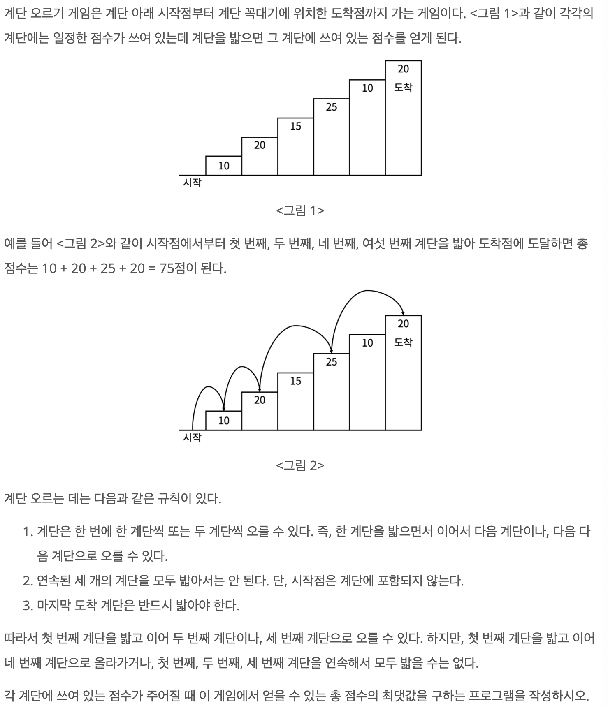
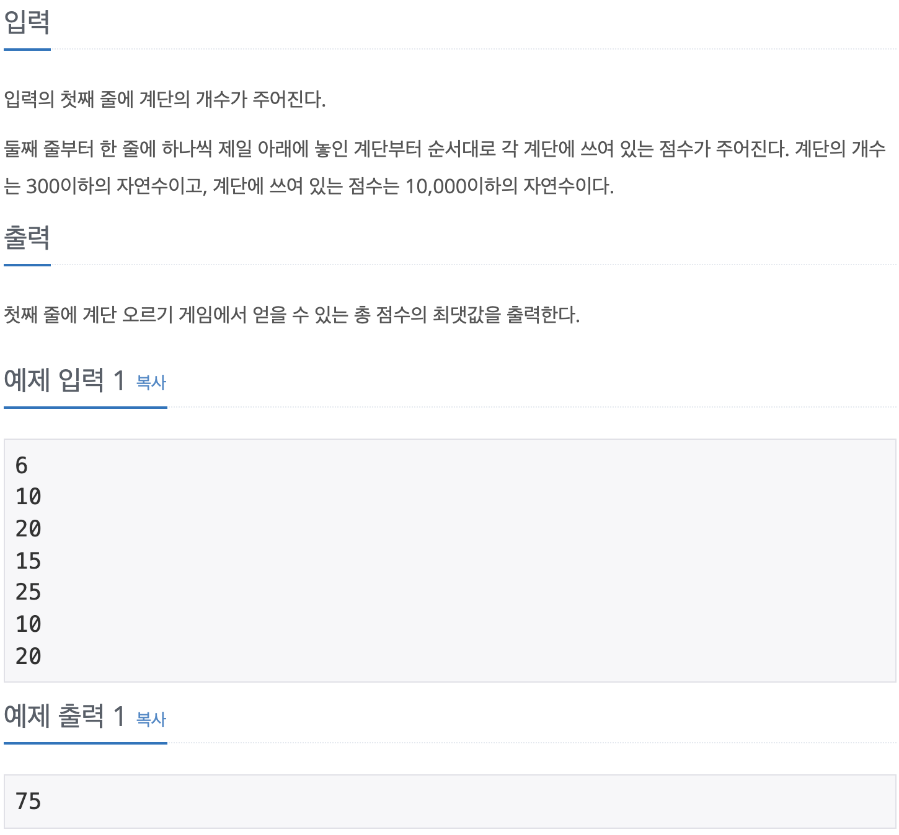

## 문제 링크

<https://www.acmicpc.net/problem/2579>
<br>

## 문제 설명


<br>

## 문제 입출력


<br>


## 풀이 방법

Dynamic Programming으로 접근하면 쉽게 할 수 있다.

DP 배열을 생성한다. 0번 인덱스의 값은 0이다.

DP 배열의 각 인덱스의 값을 생각해보자. 인덱스의 값은 해당 계단 번호를 밟았을 때 얻을 수 있는 최대 점수이다.

dp[1] - 1번 인덱스는 1번 계단을 밟았을 때, 최대 점수이다. 따라서 1번 계단 점수가 된다.

dp[2] - 2번 인덱스는 2번 계단을 밟았을 때, 최대 점수이다. 따라서 1번 계단과 2번 계단 점수의 합이다.

dp[3] - 3번 인덱스부터는, 경우의 수를 따져보자.  
`(1) : (1번 계단) + (3번 계단)`  
`(2) : (2번 계단) + (3번 계단) = (0번 계단) + (2번 계단) + (3번 계단)`

dp[4] - 4번 인덱스 경우의 수(여기서부터 자세히 보자)  
`(1) : (1번 계단) + (2번 계단) + (4번 계단)`  
`(2) : (1번 계단) + (3번 계단) + (4번 계단)`  
`(3) : (2번 계단) + (4번 계단)`

4번 인덱스는 4번째 계단을 밟았을 때 최대의 점수이다. 따라서 4번 계단을 꼭 밟아야하고, 4번 계단을 밟으려면 위와 같은 경우의 수가 있다.

`(3)`번 경우의 수는 무시해도 된다. 4번 계단을 밟기 전, 2번 계단만 밟아서는 최대 점수가 될 수 없기 때문이다.`(dp[2] = 1번 계단 + 2번 계단)`

`(1)`의 경우의 수는 1번, 2번 계단을 연속으로 밟고 4번 계단을 밟으므로 `dp[2] + 4번 계단 점수` 이다.

`(2)`의 경우는 1번 계단을 밟고 3, 4번을 연속으로 밟는다. `dp[1] + 3번 계단 점수 + 4번 계단 점수`인데, dp[3]이 되지 못한 이유는 dp[3]의 경우의 수 중 (2)로 최대 점수가 계산되었다면, 3연속 계단을 밟기 때문이다.

따라서 dp의 인덱스 계산은 `dp[i] = max(dp[i-3] + stairs[i-1] + stairs[i], dp[i-2] + stairs[i])`가 된다.

<br>

## 코드

```cpp
#include<bits/stdc++.h>
using namespace std;

int n;
int stairs[301];
int dp[301];

int main(){
    cin >> n;
    stairs[0] = 0;
    for(int i=1; i<=n; i++) cin >> stairs[i];

    dp[0] = stairs[0];
    dp[1] = stairs[1];
    dp[2] = stairs[1] + stairs[2];

    for(int i=3; i<=n; i++){
        dp[i] = max(dp[i-3] + stairs[i-1] + stairs[i], dp[i-2] + stairs[i]);
    }

    cout << dp[n] << endl;
}
```
