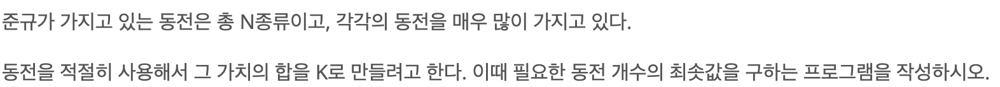
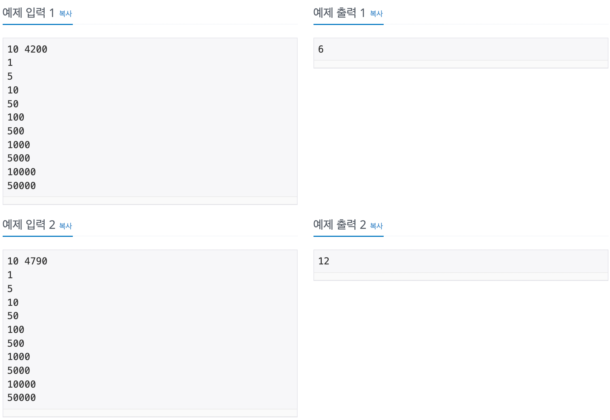

## 문제 링크

<https://www.acmicpc.net/problem/11047>
<br>

## 문제 설명


<br>

## 문제 입출력


<br>

## 풀이 방법

쉬운 그리디(Greedy) 문제이다.

입력은 동전 가치의 오름차순으로 주어진다.

동전 가치의 역순으로 반복문을 돌며 각 동전 가치 순서에서 뺄 수 있는 금액만큼 빼고 카운트한다.
<br>

## 코드

```cpp
#include<bits/stdc++.h>
using namespace std;

#define coin_num 10
int n, k;
int coins[coin_num];
int result = 0;

int main(){
    // input
    cin >> n >> k;
    for(int i=0; i<n; i++) cin >> coins[i];

    // logic
    for(int i=n-1; i>=0; i--){
        if(k >= coins[i]){
            result += k / coins[i];
            k = k % coins[i];
        }
    }
    cout << result << endl;
}
```
