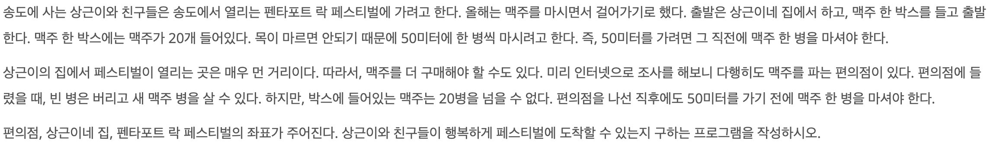
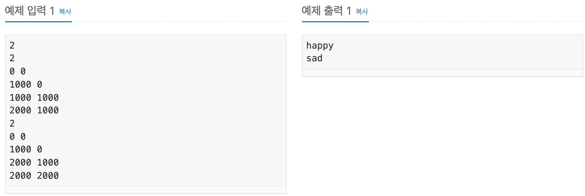

## 문제 링크

<https://www.acmicpc.net/problem/9205>
<br>

## 문제 설명


<br>

## 문제 입출력


<br>

## 풀이 방법

편의점 좌표가 오름차순 정렬된 채로 주어진 줄 알아서 첫 풀이는 입력대로 편의점 좌표를 갈 수 있는지 판단하는 로직이였다. 물론 틀렸고 모르겠어서 구글링을 통해 dfs 혹은 bfs로 푸는 방식인 것을 알았다. 집, 편의점, 락 페스티벌 좌표를 전부 그래프의 노드로 생각하며 탐색을 하는 풀이로 했어야했다. 처음에는 새로운 접근 방법이라 헷갈렸는데 혼자 끙끙하다보니 결국 풀었다.

집, 편의점들, 락페는 노드이며 최대 총 102개이다. 인접 행렬(Adjacency-matrix)으로 간선정보를 저장한다. 단, 간선은 노드가 이동할 수 있는 경로일 때 저장되어야하므로 맨해튼 거리(각 좌표 차이의 합)로 1000미터보다 같거나 작은지 조건을 확인한다. 이후에는 0번 노드인 집 좌표에서 dfs를 수행한다. dfs가 모두 수행되면, 집에서 페스티벌까지 갈 수 있는지를 `visited[n+1]`으로 확인할 수 있다. dfs로 집에서 갈 수 있는 노드들(편의점들, 락페)을 `visited`에 저장했기 때문이다.
<br>

## 코드

```cpp
#include<bits/stdc++.h>
using namespace std;

#define MAX_NUM 102

int t;
bool arr[MAX_NUM][MAX_NUM];
bool visited[MAX_NUM];
int n;
int x, y;

void dfs(int start, int end){
    visited[start] = true;
    for(int i=0; i<n+2; i++){
        if(arr[start][i] && !visited[i]) dfs(i, end);
    }
}

int main(){
    cin >> t;
    while(t--){
        vector<pair<int, int> > v;
        cin >> n;

        for(int i=0; i<n+2; i++){
            cin >> x >> y;
            v.push_back(make_pair(x, y));
        }

        for(int i=0; i<MAX_NUM; i++){
            for(int j=0; j<MAX_NUM; j++){
                arr[i][j] = false;
            }
            visited[i] = false;
        }

        for(int i=0; i<v.size(); i++){
            for(int j=0; j<v.size(); j++){
                if((abs(v[i].first - v[j].first) + abs(v[i].second - v[j].second)) <= 1000) {
                    arr[i][j] = true;
                }
            }
        }

        dfs(0, n+1);
        if(visited[n+1]) cout << "happy" << '\n';
        else cout << "sad" << '\n';
    }
}

```
