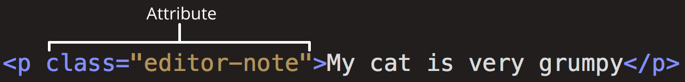
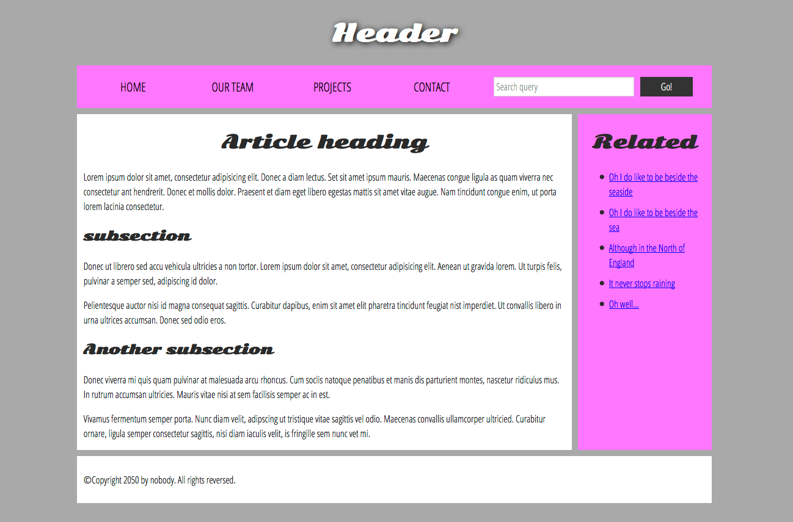
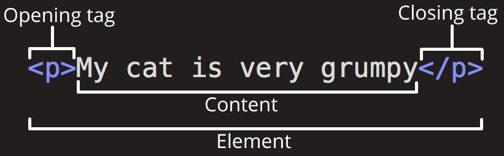

### HTML - Hyper Text Markup Language

- Hyper Text : 참조를 통해 한 문서에서 다른 문서로 접근할 수 있는 텍스트(비선형적인 특징)
- Markup Language : 태그등을 이용해 문서나 데이터의 구조를 명기하는 언어
- 컨텐츠는 텍스트, 사진, 동영상 등이 있다.
- 컨텐츠의 구조화를 위한 코드 + 웹 컨텐츠의 의미와 의도를 주기위한 코드 → 시멘틱(semantics)
- 컨텐츠는 태그로 둘러싸여 있다. → Markup Language의 특성
- 태그로 웹사이트의 전체적인 구조를 구성할 수 있다.

### HTML 요소(element)와 속성(attribute)



- 여는태그(Opening tag) : 태그이름이 꺾쇠괄호로 감싸진다. 요소의 시작을 나타낸다.
- 닫는태그(Closing tag) : 슬래시와 태그이름이 꺾쇠괄호로 감싸진다. 슬래시가 들어간 태그의 의미는 요소의 끝을 나타낸다.
- 컨텐츠(content) : 요소의 내용이며, 이 예제에서는 “My cat is very grumpy”라는 텍스트이다.
- 요소(element) : 여는태그, 닫는태그, 컨텐츠로 이루어진다.

    

- 속성은 실제 컨텐츠로 표시되길 원하지 않는 추가적인 정보를 담는다.
- 위 예제는 class 속성으로 요소의 스타일을 정하거나 정보를 사용할 때 식별자 역할을 한다.
- 속성은 요소이름과 속성사이에 공백. 속성이름 뒤 등호, 속성값(인용부호 “ 혹은 ‘가 있어야함)이 있어야 한다.
- 요소를 다른 요소 안에 넣을 수 있다. 이를 ‘중첩(nesting)’이라고 한다.

```html
<!-- 제대로 된 예제 -->
<p>내 고양이는<strong>아주</strong> 고약해.</p>

<!-- 잘못 된 예제 -->
<p>내 고양이는<strong>아주 고약해.</p></strong>
```

- 어떤 요소들은 내용을 갖지 않는데, ‘빈 요소(empty elements)’라고 한다.

### HTML 몇가지 대표적인 태그

- `<html>`은 페이지 전체를 감싸는 태그로 루트 요소라고도 한다.
- `<head>`는 웹사이트의 메타정보가 들어있는 태그이다. 페이지 설명, css, 문자 집합 선언 등이 있다.
- `<body>`는 페이지에서 보여주길 원하는 모든 컨텐츠를 담고 있다.
- ``는 이미지가 나타날 위치에 이미지를 넣는다. src 속성은 이미지 경로, alt(alternative) 속성은 볼 수 없는 이미지 일 때, 나타나는 설명문이다.

```html

```

- 문자를 나타내는 요소을 알아보자.

```html
<!-- 제목 -->
<h1>My main title</h1>
<h2>My top level heading</h2>
<h3>My subheading</h3>
<h4>My sub-subheading</h4>

<!-- 문단 -->
<p>This is a single paragraph</p>

<!-- 목록 -->
<ul>
  <li>technologists</li>
  <li>thinkers</li>
  <li>builders</li>
</ul>
```

- 문장 안의 어떤 단어를 링크로 만들 수 있는데, 이것을 연결(links)이라고 한다.

```html
<a href="https://www.mozilla.org/en-US/about/manifesto/">Mozilla Manifesto</a>
```

### 웹사이트의 기본 구조

1. header : 일반적으로 제목과 로고같은 웹사이트의 주요 정보가 있는 곳
2. navigation bar : 주로 페이지의 메인 섹션으로 연결된다.
3. main content : 실질적인 콘텐츠가 포함되는 중심의 큰 부분이며 서브영역으로 나뉠 수 있다.
4. sidebar : 일반적으로 주변의 정보, 링크, 인용 부호, 광고 등이 표시된다.
5. footer : 페이지의 바닥에 작은 정보가 있는 곳이며 저작권, 연락처와 같은 것이 있다.
   

HTML은 위와 같은 시맨틱 구현을 위해 전용 태그를 제공한다.

- header: `<header>`
- navigation bar: `<nav>`
- main content: `<main>` 그리고, 하위 섹션인 `<article>`, `<section>`, `<div>`
- sidebar: `<aside>` 종종 main 안에 위치된다.
- footer: `<footer>`

### BOX, ITEM 그리고 BLOCK, INLINE

- BOX vs ITEM
  - box : sectioning이 목적이고, 눈에 보이지 않는 요소들 `<header>`, `<div>` 등
  - item : 눈에 보여지는 것들. `<a>`, `<button>`, `` 등
- BLOCK vs INLINE
  - block : 한 줄 전체를 차지하는 요소 `<p>`,
  - inline : 요소의 좌우에 올 수 있음. `<span>`
  - 두 개념 모두 item의 하위개념

> [MDN Web Docs](https://developer.mozilla.org/en-US/docs/Web/HTML)의 `HTML 관련 문서들`을 참조했습니다.
