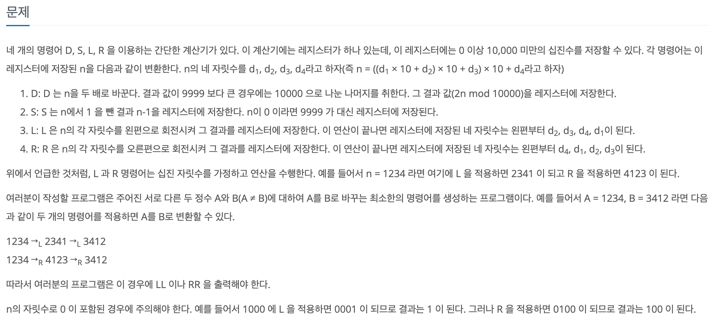

## 문제 링크

<https://www.acmicpc.net/problem/9019>
<br>

## 문제 설명

  
<br>

## 문제 입출력

  
<br>

## 풀이 방법

BFS로 풀 수 있다. 나올 수 있는 수는 0부터 9999까지 한정되어 있으므로, 숫자를 노드라고 생각하면 된다. 엣지는 해당 노드(숫자)와 연산으로 표현될 수 있다. 예를 들어, 숫자는 `0001`, 연산은 `L`이라면 결과는 `0010`이다. 단, 여러 연산으로 표현될 수 있는데, `RRR` 연산으로도 `0001` -> `0010`이 된다. 시작 노드(A)부터 종료 노드(B)까지 각 노드에서 `D`, `S`, `L`, `R` 연산을 수행하여 탐색을 진행한다. 문제의 조건은 `최소한의 명령어`이므로 BFS을 수행하다가 가장 먼저 `B`와 같은 결과가 나온다면, 해당 연산을 출력하고 탐색을 중단하면 된다.
<br>

## 코드

```cpp
#include<bits/stdc++.h>
using namespace std;

int a, b;
bool visited[10000];

void bfs(){
    queue<pair<int, string> > q;
    q.push(make_pair(a, ""));
    visited[a] = true;
    int new_num;

    while(!q.empty()){
        int cur_num = q.front().first;
        string cur_str = q.front().second;
        q.pop();

        if(cur_num == b){
            cout << cur_str << "\n";
            return;
        }

        new_num = (cur_num*2) % 10000;
        if(!visited[new_num]){
            visited[new_num] = true;
            q.push(make_pair(new_num, cur_str + 'D'));
        }

        new_num = cur_num-1;
        if(new_num < 0) new_num = 9999;
        if(!visited[new_num]){
            visited[new_num] = true;
            q.push(make_pair(new_num, cur_str + 'S'));
        }

        new_num = (cur_num%1000)*10 + (cur_num/1000);
        if(!visited[new_num]){
            visited[new_num] = true;
            q.push(make_pair(new_num, cur_str + 'L'));
        }

        new_num = cur_num/10 + (cur_num%10)*1000;
        if(!visited[new_num]){
            visited[new_num] = true;
            q.push(make_pair(new_num, cur_str + 'R'));
        }
    }
}

int main(){
    ios_base::sync_with_stdio(false);
    cin.tie(NULL);
    cout.tie(NULL);

    int t;
    cin >> t;
    while(t--){
        cin >> a >> b;
        memset(visited, false, sizeof(visited));
        bfs();
    }
    return 0;

}
```

## 첨언

처음에는 그리디한 방식으로 무언가 최적화된 방법이 있을 줄 알았다. 하지만 이 문제는 출력이 여러 개일 수 있으므로 그리디하게 풀 수 없다. 또한 어떻게 구체적으로 어떤 접근을 해야할 지는 생각하지 않았지만 DP로도 풀 수 있겠다는 생각은 했다. 막상 하려니까 못했고... 결국 구글링을 해서 BFS로 접근해야 한다는 것을 알았다. BFS나 DFS는 탐색의 일종이라 그래프에서만 사용했었는데, 사고의 확장으로 이러한 문제에서도 적용시킬 수 있다는 것을 알았다. <b>유연한 사고<b>!!!
