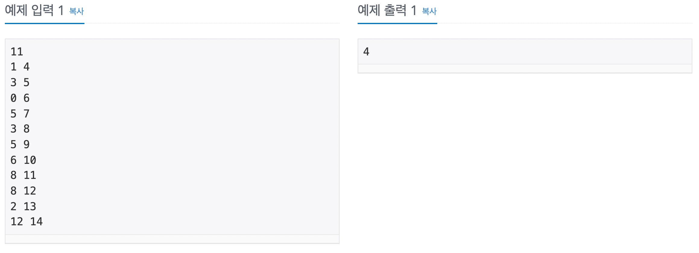

## 문제 링크

<https://www.acmicpc.net/problem/1931>
<br>

## 문제 설명  


## 문제 입출력  


## 풀이 방법

그리디 유형이다. 회의 시간(종료 시간 - 시작 시간)은 상관없다. 모든 회의 시간 정보를 읽어오고 정렬을 해야한다. 단, 첫번째 key는 종료 시간, 두번째 key는 시작 시간으로 오름차순 정렬을 수행해야 한다.
<br>

## 코드

```cpp
#include<bits/stdc++.h>
using namespace std;

int main(){

    // 회의의 개수 n
    int n, a, b;
    cin >> n;
    // 회의들의 시작시간과 종료시간을 저장할 vector
    vector<pair<int, int> > v;

    for(int i=0; i<n; i++){
        cin >> a >> b;
        // 회의가 끝나는 시간을 pair의 first로 넣으므로써, 끝나는 시간 기준 정렬을 용이하게 함.
        v.push_back(make_pair(b, a));
    }
    // 회의가 끝나는 시간 기준으로 오름차순 정렬 수행, 끝나는 시간이 같다면 시작 시간이 빠른것부터
    sort(v.begin(), v.end());

    // 끝나는 시간이 가장 빠른 것을 먼저 넣어줌
    int result = 1;
    pair<int, int> p = v[0];

    for(int i=1; i<n; i++){
        // 현재 회의의 끝나는 시간이 지났다면 == 현재 회의 끝나는 시간과 다음 회의 시작 시간이 같거나 크다면
        if(p.first <= v[i].second) {
            // 현재 회의를 갱신
            p = v[i];
            result++;
        }
    }
    cout << result << '\n';
}
```
